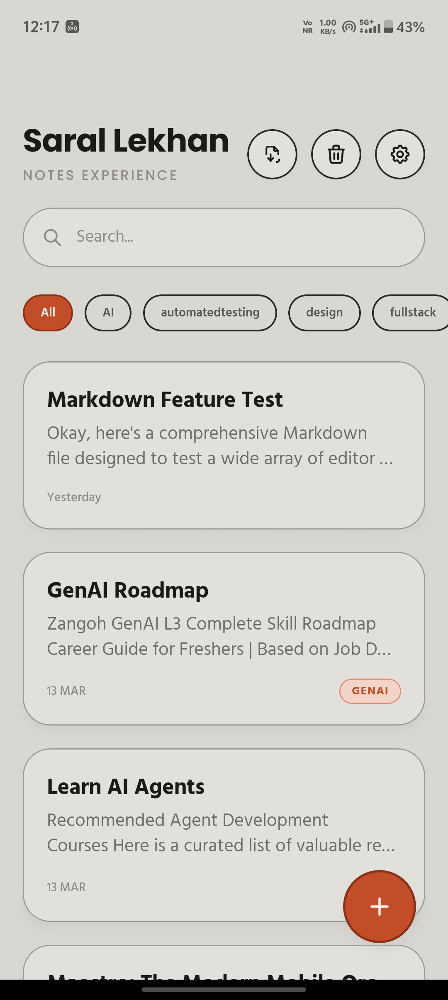
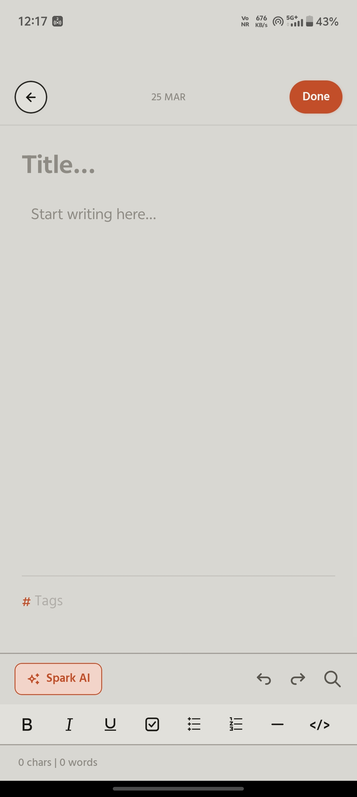
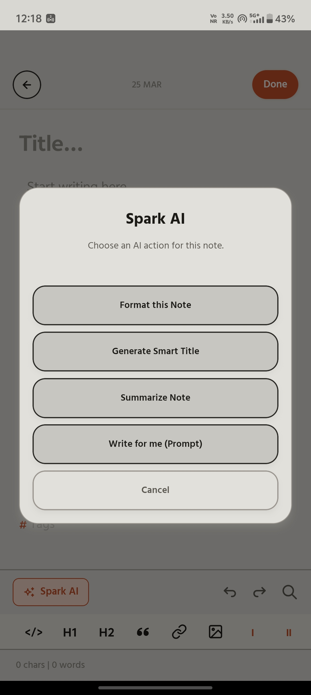
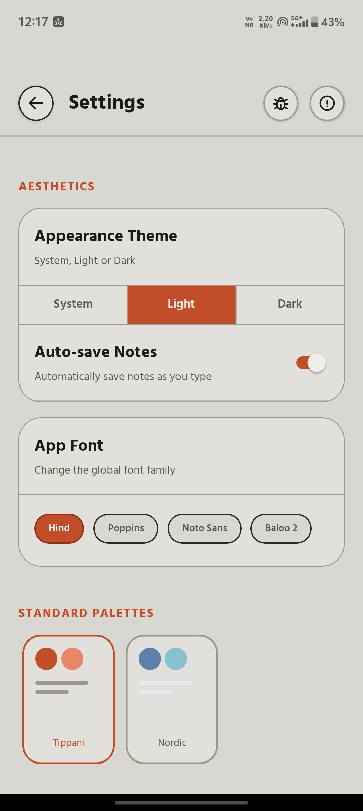
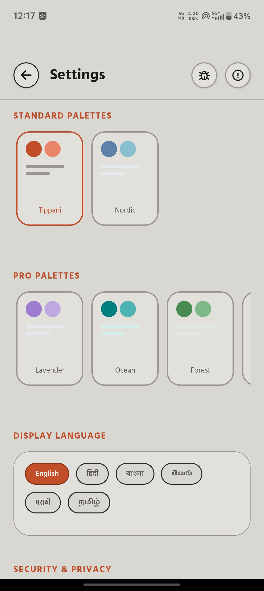
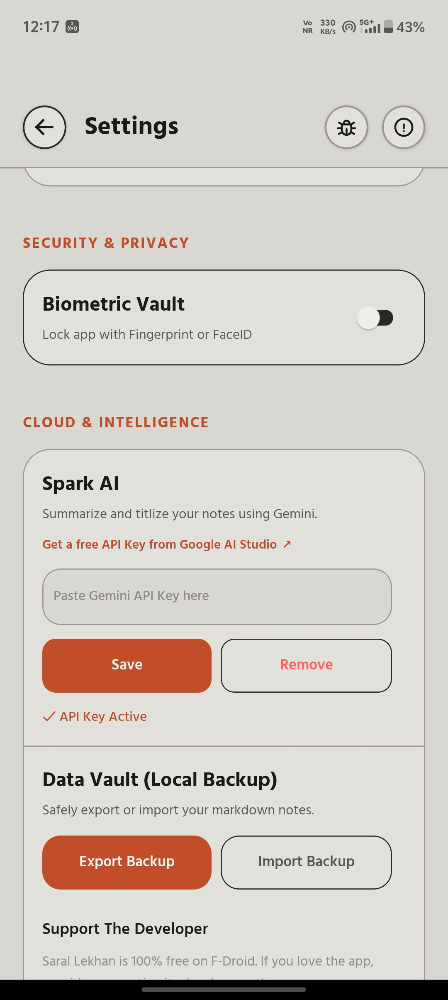

# सरल लेखन (Saral Lekhan Plus)

<p align="center">
  
</p>

<p align="center">
  <em>A beautiful, privacy-focused note-taking app with AI writing tools</em>
</p>

<p align="center">
  <a href="https://github.com/NxAdx/saral-lekhan-pro/releases/latest"></a>
  <a href="LICENSE"></a>
  <a href="https://github.com/NxAdx/saral-lekhan-pro/actions"></a>
</p>

---

## Features

| Feature | Description |
|---------|-------------|
| Rich Text Editor | Bold, italic, underline, H1/H2, blockquote, lists, checkboxes, code blocks, images, and links |
| Spark AI | Optional AI writing help with your own Gemini API key |
| Themes | Multiple handcrafted themes with light and dark mode support |
| Privacy First | No accounts, no tracking, no ads, local-first data storage, optional biometric lock |
| Multi-Language | Full UI in English, Hindi, and more, including Hindi punctuation support |
| Export | Share notes as beautifully formatted PDFs |
| Trash & Recovery | Recover deleted notes or empty all trash |
| Find & Replace | Built-in search and replace in the editor |
| Tags | Organize notes with tags for quick search |
| Backup & Restore | Export and import your local database |

## Screenshots

<p align="center">
  
  
  
  
  
  
  
</p>

## Download

| Source | Link |
|--------|------|
| GitHub Releases | [Download Latest APK](https://github.com/NxAdx/saral-lekhan-pro/releases/latest) |
| F-Droid | Submission update in progress |

## Build from Source

```bash
# Clone the repo
git clone https://github.com/NxAdx/saral-lekhan-pro.git
cd saral-lekhan-pro

# Install dependencies
npm ci --legacy-peer-deps

# Start development server
npm run start

# Build the direct GitHub/Play release artifacts
npm run build:android:direct

# Build the F-Droid flavor
npm run build:android:fdroid
```

Requirements: Node.js 18+, Java 17, Android SDK 34

## Tech Stack

- Framework: React Native + Expo SDK 49
- Editor: react-native-pell-rich-editor
- State: Zustand
- Database: expo-sqlite
- AI: Google Gemini API (user-provided key)
- Build: Committed native Android project with direct + F-Droid flavors
- **AI-Enhanced Development**:
  - Agent Skills: Integrated official Android modular skills for Compose, AGP, and R8.
  - Automation: Powered by the Google Android CLI.

## Privacy & Security

- No analytics or tracking SDKs
- No Firebase, Sentry, or Crashlytics
- No ads or monetization SDKs
- API keys stored in device SecureStore
- All data stored locally on-device
- Optional biometric authentication
- Spark AI is optional and only connects to Gemini after you add your own API key
- The F-Droid build disables the in-app updater, Expo OTA URL, and startup runtime-flag fetches

## Contributing

Contributions are welcome. Please open an issue first to discuss what you'd like to change.

1. Fork the repo
2. Create your branch (`git checkout -b feature/amazing-feature`)
3. Commit your changes (`git commit -m 'Add amazing feature'`)
4. Push to the branch (`git push origin feature/amazing-feature`)
5. Open a Pull Request

## License

This project is licensed under the MIT License. See the [LICENSE](LICENSE) file for details.

## Support the Developer

Saral Lekhan is 100% free and open-source. If you love the app, consider supporting its development.

- UPI (India): Open the app -> Settings -> Support The Developer
- Ko-fi (Global): [ko-fi.com/aadarshlokhande](https://ko-fi.com/aadarshlokhande)

---

<p align="center">
  Made with love by <a href="https://github.com/NxAdx">Aadarsh Lokhande</a>
</p>
